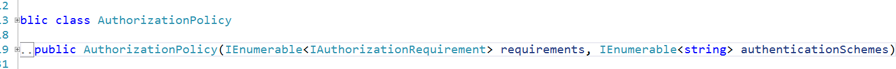

## 1.简单的登录,生成cookie

- 加入cookie中间件

~~~c#
builder.Services.AddAuthentication("CookieAuth")
    .AddCookie("CookieAuth", config =>
    {
        config.Cookie.Name = "Grandmas.Cookie";
        config.LoginPath = "/Home/Authenticate";
    });
~~~

- 使用Authentication,Authorization中间件

~~~ c#
app.UseAuthentication();
app.UseAuthorization();
~~~

- 给需要验证权限的action attribute

~~~ c#
[Authorize]
public IActionResult Secret()
{
    return View();
}
~~~

- 构建ClaimsPrincipal ,并登录

~~~ c#
 public IActionResult Authenticate()
 {
     var grandmaClaims = new List<Claim>()
     {
         new Claim(ClaimTypes.Name, "Bob"),
         new Claim(ClaimTypes.Email, "Bob@fmail.com"),
         new Claim("Grandma.Says", "Very nice boi."),
     };

     var licenseClaims = new List<Claim>()
     {
         new Claim(ClaimTypes.Name, "Bob K Foo"),
         new Claim("DrivingLicense", "A+"),
     };

     var grandmaIdentity = new ClaimsIdentity(grandmaClaims, "Grandma Identity");
     var licenseIdentity = new ClaimsIdentity(licenseClaims, "Government");

     var userPrincipal = new ClaimsPrincipal(new[] { grandmaIdentity, licenseIdentity });

     HttpContext.SignInAsync(userPrincipal);

     return RedirectToAction("Index");
 }
~~~

- 调用Authenticate() 方法生成cookie

## 2.Authorization Policy (授权策略)

- default policy,如果什么都不配置,那么久如同下面的代码一样

~~~c#
builder.Services.AddAuthorization(config =>
{
    var defaultAuthBuilder = new AuthorizationPolicyBuilder();
    var defaultAuthPolicy = defaultAuthBuilder.RequireAuthenticatedUser().Build();

    config.DefaultPolicy = defaultAuthPolicy;
});
~~~

- 也可以链式配置

~~~c#
builder.Services.AddAuthorization(config =>
{
    var defaultAuthBuilder = new AuthorizationPolicyBuilder();
    var defaultAuthPolicy = defaultAuthBuilder
        .RequireAuthenticatedUser()
        .RequireClaim(ClaimTypes.DateOfBirth)
        .Build();

    config.DefaultPolicy = defaultAuthPolicy;
});
~~~

- 通过源码可以看到,构建一个AuthorizationPolicy需要一个AuthorizationRequirement 和一个 authenticationSchemes

- 构建自定义的AuthorizationRequirement

~~~ c#
public class CustomRequireClaim:IAuthorizationRequirement
    {
        public CustomRequireClaim(string claimType)
        {
            ClaimType = claimType;
        }

        public string ClaimType { get; }
    }

    public class CustomRequireClaimHandler : AuthorizationHandler<CustomRequireClaim>
    {
        protected override Task HandleRequirementAsync(
            AuthorizationHandlerContext context,
            CustomRequireClaim requirement)
        {
            var hasClaim = context.User.Claims.Any(x => x.Type == requirement.ClaimType);
            if (hasClaim)
            {
                context.Succeed(requirement);
            }

            return Task.CompletedTask;
        }
    }
~~~

- 注册 AuthorizationPolicy 时使用自定义的AuthorizationRequirement,并将AuthorizationHandler 加入到依赖注入容器中

~~~ c#
config.AddPolicy("Claim.DoB", authPolicyBuilder =>
    {
        authPolicyBuilder.AddRequirements(new CustomRequireClaim(ClaimTypes.DateOfBirth));
    });
~~~

~~~ c#
builder.Services.AddScoped<IAuthorizationHandler, CustomRequireClaimHandler>();
~~~

- 使用

~~~c#
[Authorize(Policy = "Claim.DoB")]
public IActionResult SecretPolicy()
{
    return View("Secret");
}
~~~

## 3.授权,验证一些扩展方法

- 方法内进行权限判断

~~~c#
 //Hello 为Policy Name
var authResult = await _authorizationService.AuthorizeAsync(User, "Hello");

if (authResult.Succeeded)
{
    //...
}
~~~

~~~c#
 var builder = new AuthorizationPolicyBuilder("Schema");
var customPolicy = builder.RequireClaim("Hello").Build();

//Hello 为Policy Name
var authResult = await _authorizationService.AuthorizeAsync(User, customPolicy);

if (authResult.Succeeded)
{
    //...
}
~~~

