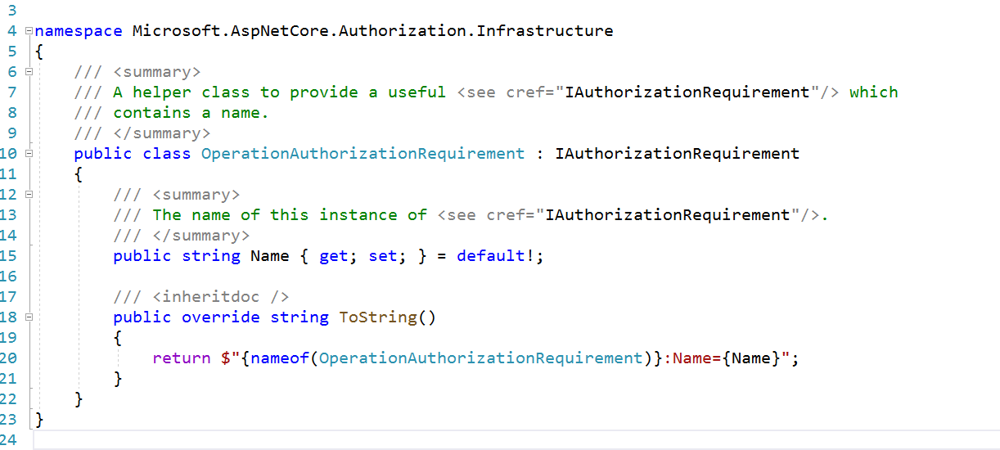

## 1.简单的登录,生成cookie

- 加入cookie中间件

~~~c#
builder.Services.AddAuthentication("CookieAuth")
    .AddCookie("CookieAuth", config =>
    {
        config.Cookie.Name = "Grandmas.Cookie";
        config.LoginPath = "/Home/Authenticate";
    });
~~~

- 使用Authentication,Authorization中间件

~~~ c#
app.UseAuthentication();
app.UseAuthorization();
~~~

- 给需要验证权限的action attribute

~~~ c#
[Authorize]
public IActionResult Secret()
{
    return View();
}
~~~

- 构建ClaimsPrincipal ,并登录

~~~ c#
 public IActionResult Authenticate()
 {
     var grandmaClaims = new List<Claim>()
     {
         new Claim(ClaimTypes.Name, "Bob"),
         new Claim(ClaimTypes.Email, "Bob@fmail.com"),
         new Claim("Grandma.Says", "Very nice boi."),
     };

     var licenseClaims = new List<Claim>()
     {
         new Claim(ClaimTypes.Name, "Bob K Foo"),
         new Claim("DrivingLicense", "A+"),
     };

     var grandmaIdentity = new ClaimsIdentity(grandmaClaims, "Grandma Identity");
     var licenseIdentity = new ClaimsIdentity(licenseClaims, "Government");

     var userPrincipal = new ClaimsPrincipal(new[] { grandmaIdentity, licenseIdentity });

     HttpContext.SignInAsync(userPrincipal);

     return RedirectToAction("Index");
 }
~~~

- 调用Authenticate() 方法生成cookie

## 2.Authorization Policy (授权策略)

- default policy,如果什么都不配置,那么久如同下面的代码一样

~~~c#
builder.Services.AddAuthorization(config =>
{
    var defaultAuthBuilder = new AuthorizationPolicyBuilder();
    var defaultAuthPolicy = defaultAuthBuilder.RequireAuthenticatedUser().Build();

    config.DefaultPolicy = defaultAuthPolicy;
});
~~~

- 也可以链式配置

~~~c#
builder.Services.AddAuthorization(config =>
{
    var defaultAuthBuilder = new AuthorizationPolicyBuilder();
    var defaultAuthPolicy = defaultAuthBuilder
        .RequireAuthenticatedUser()
        .RequireClaim(ClaimTypes.DateOfBirth)
        .Build();

    config.DefaultPolicy = defaultAuthPolicy;
});
~~~

- 通过源码可以看到,构建一个AuthorizationPolicy需要一个AuthorizationRequirement 和一个 authenticationSchemes

- 构建自定义的AuthorizationRequirement

~~~ c#
public class CustomRequireClaim:IAuthorizationRequirement
    {
        public CustomRequireClaim(string claimType)
        {
            ClaimType = claimType;
        }

        public string ClaimType { get; }
    }

    public class CustomRequireClaimHandler : AuthorizationHandler<CustomRequireClaim>
    {
        protected override Task HandleRequirementAsync(
            AuthorizationHandlerContext context,
            CustomRequireClaim requirement)
        {
            var hasClaim = context.User.Claims.Any(x => x.Type == requirement.ClaimType);
            if (hasClaim)
            {
                context.Succeed(requirement);
            }

            return Task.CompletedTask;
        }
    }
~~~

- 注册 AuthorizationPolicy 时使用自定义的AuthorizationRequirement,并将AuthorizationHandler 加入到依赖注入容器中

~~~ c#
config.AddPolicy("Claim.DoB", authPolicyBuilder =>
    {
        authPolicyBuilder.AddRequirements(new CustomRequireClaim(ClaimTypes.DateOfBirth));
    });
~~~

~~~ c#
builder.Services.AddScoped<IAuthorizationHandler, CustomRequireClaimHandler>();
~~~

- 使用

~~~c#
[Authorize(Policy = "Claim.DoB")]
public IActionResult SecretPolicy()
{
    return View("Secret");
}
~~~

## 3.授权,验证一些扩展方法

- 方法内进行权限判断

~~~c#
 //Hello 为Policy Name
var authResult = await _authorizationService.AuthorizeAsync(User, "Hello");

if (authResult.Succeeded)
{
    //...
}
~~~

~~~c#
 var builder = new AuthorizationPolicyBuilder("Schema");
var customPolicy = builder.RequireClaim("Hello").Build();

//Hello 为Policy Name
var authResult = await _authorizationService.AuthorizeAsync(User, customPolicy);

if (authResult.Succeeded)
{
    //...
}
~~~

- 添加全局身份认证过滤器

~~~ c#
builder.Services.AddControllersWithViews(cofig =>
{
    var defaultAuthBuilder = new AuthorizationPolicyBuilder();
    var defaultAuthPolicy = defaultAuthBuilder
        .RequireAuthenticatedUser()
        .Build();

    cofig.Filters.Add(new AuthorizeFilter(defaultAuthPolicy));
});
~~~

- 利用系统内置的OperationAuthorizationRequirement(继承自IAuthorizationRequirement) 提供权限判断

利用该IAuthorizationRequirement 实施权限判断

~~~ c#
 public class OperationsController : Controller
    {
        private readonly IAuthorizationService _authorizationService;

        public OperationsController(IAuthorizationService authorizationService)
        {
            _authorizationService = authorizationService;
        }

        public async Task<IActionResult> Open()
        {
            var cookieJar = new CookieJar(); // get cookie jar from db
            await _authorizationService.AuthorizeAsync(User, cookieJar, CookieJarAuthOperations.Open);
            return View();
        }
    }

    public class CookieJarAuthorizationHandler
        : AuthorizationHandler<OperationAuthorizationRequirement, CookieJar>
    {
        protected override Task HandleRequirementAsync(
            AuthorizationHandlerContext context,
            OperationAuthorizationRequirement requirement,
            CookieJar cookieJar)
        {
            if (requirement.Name == CookieJarOperations.Look)
            {
                if (context.User.Identity!.IsAuthenticated)
                {
                    context.Succeed(requirement);
                }
            }
            else if (requirement.Name == CookieJarOperations.ComeNear)
            {
                if (context.User.HasClaim("Friend", "Good"))
                {
                    context.Succeed(requirement);
                }
            }

            return Task.CompletedTask;
        }
    }

    public static class CookieJarAuthOperations
    {
        public static OperationAuthorizationRequirement Open = new OperationAuthorizationRequirement
        {
            Name = CookieJarOperations.Open
        };
    }

    public static class CookieJarOperations
    {
        public static string Open = "Open";
        public static string TakeCookie = "TakeCookie";
        public static string ComeNear = "ComeNear";
        public static string Look = "Look";
    }

    public class CookieJar
    {
        public string Name { get; set; } = null!;
    }
~~~

## 4.利用IClaimsTransformation 转化claim

每次访问action都会做出转化

~~~ c#
 public class ClaimsTransformation : IClaimsTransformation
    {
        public Task<ClaimsPrincipal> TransformAsync(ClaimsPrincipal principal)
        {
            var hasFriendClaim = principal.Claims.Any(x => x.Type == "Friend");

            if (!hasFriendClaim)
            {
                ((ClaimsIdentity)principal.Identity!).AddClaim(new Claim("Friend", "Bad"));
            }

            return Task.FromResult(principal);
        }
    }
~~~

## 5.自定义授权策略提供者(根据 AuthorizeAttribute 中的名称自动生成policy)

自定义定义的IAuthorizationPolicyProvider

~~~ c#
public class SecurityLevelAttribute : AuthorizeAttribute
    {
        public SecurityLevelAttribute(int level)
        {
            Policy = $"{DynamicPilicies.SecurityLevel}.{level}";
        }
    }

    // {type}
    public static class DynamicPilicies
    {
        public static IEnumerable<string> Get()
        {
            yield return SecurityLevel;
            yield return Rank;
        }

        public const string SecurityLevel = "SecurityLevel";
        public const string Rank = "Rank";
    }

    public static class DynamicAuthorizationPilicyFactory
    {
        public static AuthorizationPolicy? Create(string policyName)
        {
            var parts = policyName.Split('.');
            var type = parts.First();
            var value = parts.Last();

            switch (type)
            {
                case DynamicPilicies.Rank:
                    return new AuthorizationPolicyBuilder()
                        .RequireClaim("Rank", value)
                        .Build();
                case DynamicPilicies.SecurityLevel:
                    return new AuthorizationPolicyBuilder()
                        .AddRequirements(new SecurityLevelRequirement(Convert.ToInt32(value)))
                        .Build();
                default:
                    return null;
            }
        }
    }

    public class SecurityLevelRequirement : IAuthorizationRequirement
    {
        public int Level { get; }
        public SecurityLevelRequirement(int level)
        {
            Level = level;
        }
    }

    public class SecurityLevelHandler : AuthorizationHandler<SecurityLevelRequirement>
    {
        protected override Task HandleRequirementAsync(
            AuthorizationHandlerContext context,
            SecurityLevelRequirement requirement)
        {
            var claimValue = Convert.ToInt32(context.User.Claims
                .FirstOrDefault(x => x.Type == DynamicPilicies.SecurityLevel)
                ?.Value ?? "0");

            if (requirement.Level <= claimValue)
            {
                context.Succeed(requirement);
            }
            return Task.CompletedTask;
        }
    }

    public class CustomAuthorizationPolicyProvider
        : DefaultAuthorizationPolicyProvider
    {
        public CustomAuthorizationPolicyProvider(IOptions<AuthorizationOptions> options) : base(options)
        {
        }

        public override Task<AuthorizationPolicy?> GetPolicyAsync(string policyName)
        {
            foreach (var customPolicy in DynamicPilicies.Get())
            {
                if (policyName.StartsWith(customPolicy))
                {
                    var policy = DynamicAuthorizationPilicyFactory.Create(policyName);

                    return Task.FromResult(policy);
                }
            }

            return base.GetPolicyAsync(policyName);
        }
    }
~~~

使用

~~~ c#
[SecurityLevel(5)]
public IActionResult SecretLevel()
{
    return View("Secret");
}

[SecurityLevel(10)]
public IActionResult SecretHigherLevel()
{
    return View("Secret");
}
~~~

