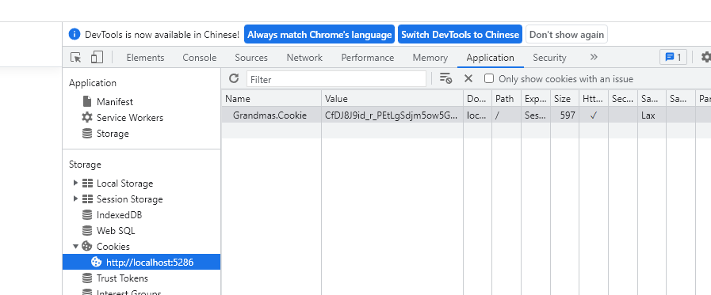

## 简单的登录,生成cookie

- 加入cookie中间件

~~~c#
builder.Services.AddAuthentication("CookieAuth")
    .AddCookie("CookieAuth", config =>
    {
        config.Cookie.Name = "Grandmas.Cookie";
        config.LoginPath = "/Home/Authenticate";
    });
~~~

- 使用Authentication,Authorization中间件

~~~ c#
app.UseAuthentication();
app.UseAuthorization();
~~~

- 给需要验证权限的action attribute

~~~ c#
[Authorize]
public IActionResult Secret()
{
    return View();
}
~~~

- 构建ClaimsPrincipal ,并登录

~~~ c#
 public IActionResult Authenticate()
 {
     var grandmaClaims = new List<Claim>()
     {
         new Claim(ClaimTypes.Name, "Bob"),
         new Claim(ClaimTypes.Email, "Bob@fmail.com"),
         new Claim("Grandma.Says", "Very nice boi."),
     };

     var licenseClaims = new List<Claim>()
     {
         new Claim(ClaimTypes.Name, "Bob K Foo"),
         new Claim("DrivingLicense", "A+"),
     };

     var grandmaIdentity = new ClaimsIdentity(grandmaClaims, "Grandma Identity");
     var licenseIdentity = new ClaimsIdentity(licenseClaims, "Government");

     var userPrincipal = new ClaimsPrincipal(new[] { grandmaIdentity, licenseIdentity });

     HttpContext.SignInAsync(userPrincipal);

     return RedirectToAction("Index");
 }
~~~

- 调用Authenticate() 方法生成cookie

