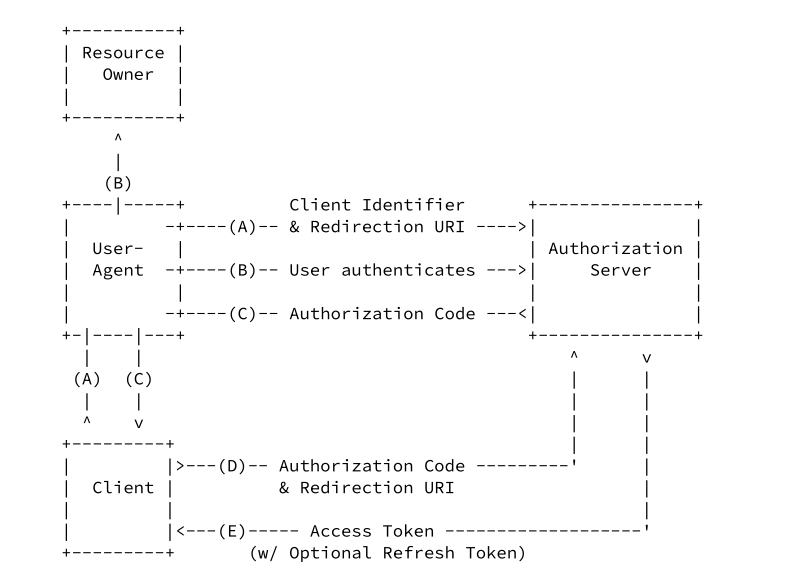

### 1.JWT 格式的 Authentication

~~~c#
builder.Services.AddAuthentication(JwtBearerDefaults.AuthenticationScheme)
    .AddJwtBearer(JwtBearerDefaults.AuthenticationScheme, config =>
    {
        var secretBytes = Encoding.UTF8.GetBytes(Constants.Secret);
        var key = new SymmetricSecurityKey(secretBytes);

        config.Events = new JwtBearerEvents()
        {
            OnMessageReceived = context =>
            {
                if (context.Request.Query.ContainsKey("access_token"))
                {
                    context.Token = context.Request.Query["access_token"];
                }

                return Task.CompletedTask;
            }
        };

        config.TokenValidationParameters = new TokenValidationParameters()
        {
            ValidIssuer = Constants.Issuer,
            ValidAudience = Constants.Audiance,
            IssuerSigningKey = key,
        };
    });
~~~

~~~ c#
   public IActionResult Authenticate()
        {
            var claims = new[]
            {
                new Claim(JwtRegisteredClaimNames.Sub, "some_id"),
                new Claim("granny", "cookie")
            };

            var secretBytes = Encoding.UTF8.GetBytes(Constants.Secret);
            var key = new SymmetricSecurityKey(secretBytes);
            var algorithm = SecurityAlgorithms.HmacSha256;

            var signingCredentials = new SigningCredentials(key, algorithm);

            var token = new JwtSecurityToken(
                Constants.Issuer,
                Constants.Audiance,
                claims,
                notBefore: DateTime.Now,
                expires: DateTime.Now.AddHours(1),
                signingCredentials);

            var tokenJson = new JwtSecurityTokenHandler().WriteToken(token);

            return Ok(new { access_token = tokenJson });
        }
~~~

### 2.oauth2.0  Authorization Code Grant

**Client**

~~~ c#
builder.Services.AddAuthentication(config => {
        // We check the cookie to confirm that we are authenticated
        config.DefaultAuthenticateScheme = "ClientCookie";
        // When we sign in we will deal out a cookie
        config.DefaultSignInScheme = "ClientCookie";
        // use this to check if we are allowed to do something.
        config.DefaultChallengeScheme = "OurServer";
    })
    .AddCookie("ClientCookie")
    .AddOAuth("OurServer", config => {
        config.ClientId = "client_id";
        config.ClientSecret = "client_secret";
         config.CallbackPath = new PathString("/authorization-code/callback");
        config.AuthorizationEndpoint = "https://localhost:7265/oauth/authorize";
        config.TokenEndpoint = "https://localhost:7265/oauth/token";

        config.SaveTokens = true;

        config.Events = new OAuthEvents()
        {
            OnCreatingTicket = context =>
            {
                var accessToken = context.AccessToken;
                if (accessToken!=null)
                {
                    var base64payload = accessToken.Split('.')[1];
                    var bytes = Convert.FromBase64String(base64payload);
                    var jsonPayload = Encoding.UTF8.GetString(bytes);
                    var claims = JsonConvert.DeserializeObject<Dictionary<string, string>>(jsonPayload);

                    foreach (var claim in claims)
                    {
                        context.Identity?.AddClaim(new Claim(claim.Key, claim.Value));
                    }

                   
                }

                return Task.CompletedTask;

            }
        };
    });
~~~

**Server**

~~~c#
 public class OAuthController : Controller
    {
        [HttpGet]
        public IActionResult Authorize(
            string response_type, // authorization flow type 
            string client_id, // client id
            string redirect_uri,
            string scope, // what info I want = email,grandma,tel
            string state) // random string generated to confirm that we are going to back to the same client
        {
            // ?a=foo&b=bar
            var query = new QueryBuilder();
            query.Add("redirectUri", redirect_uri);
            query.Add("state", state);

            return View(model: query.ToString());
        }

        [HttpPost]
        public IActionResult Authorize(
            string username,
            string redirectUri,
            string state)
        {
            const string code = "BABAABABABA";

            var query = new QueryBuilder();
            query.Add("code", code);
            query.Add("state", state);

            return Redirect($"{redirectUri}{query.ToString()}");
        }

        public async Task<IActionResult> Token(
            string grant_type, // flow of access_token request
            string code, // confirmation of the authentication process
            string redirect_uri,
            string client_id)
        {
            // some mechanism for validating the code

            var claims = new[]
          {
                new Claim(JwtRegisteredClaimNames.Sub, "some_id"),
                new Claim("granny", "cookie")
            };

            var secretBytes = Encoding.UTF8.GetBytes(Constants.Secret);
            var key = new SymmetricSecurityKey(secretBytes);
            var algorithm = SecurityAlgorithms.HmacSha256;

            var signingCredentials = new SigningCredentials(key, algorithm);

            var token = new JwtSecurityToken(
                Constants.Issuer,
                Constants.Audiance,
                claims,
                notBefore: DateTime.Now,
                expires: DateTime.Now.AddHours(1),
                signingCredentials);

            var access_token = new JwtSecurityTokenHandler().WriteToken(token);

            var responseObject = new
            {
                access_token,
                token_type = "Bearer",
                raw_claim = "oauthTutorial"
            };

            var responseJson = JsonConvert.SerializeObject(responseObject);

            return new JsonResult(responseObject);
        }
    }
~~~

### 3.增加 api 资源

client访问受限的api资源,需要先在auth Server 端进行登录,获取token后携带token 访问api,api 检查token中间件会检查request中的token并向auth Server端进行验证(初始代码基于上面的2( Authorization Code Grant))

**api端**

~~~c#
builder.Services.AddAuthorization(config =>
{
    var defaultAuthBuilder = new AuthorizationPolicyBuilder();
    var defaultAuthPolicy = defaultAuthBuilder
        .AddRequirements(new JwtRequirement())
        .Build();

    config.DefaultPolicy = defaultAuthPolicy;
});

builder.Services.AddScoped<IAuthorizationHandler, JwtRequirementHandler>();
~~~

~~~c#
 public class JwtRequirement : IAuthorizationRequirement { }

    public class JwtRequirementHandler : AuthorizationHandler<JwtRequirement>
    {
        private readonly HttpClient _client;
        private readonly HttpContext _httpContext;

        public JwtRequirementHandler(
            IHttpClientFactory httpClientFactory,
            IHttpContextAccessor httpContextAccessor)
        {
            _client = httpClientFactory.CreateClient();
            _httpContext = httpContextAccessor.HttpContext!;
        }

        protected override async Task HandleRequirementAsync(
            AuthorizationHandlerContext context,
            JwtRequirement requirement)
        {
            if (_httpContext.Request.Headers.TryGetValue("Authorization", out var authHeader))
            {
                var accessToken = authHeader.ToString().Split(' ')[1];

                //拿出access_token ,发送给授权服务器进行验证
                var response = await _client
                    .GetAsync($"https://localhost:7265/oauth/validate?access_token={accessToken}");

                if (response.StatusCode == System.Net.HttpStatusCode.OK)
                {
                    context.Succeed(requirement);
                }
            }
        }
    }
~~~

**Auth Server端**

~~~c#
[Authorize]
public IActionResult Validate()
{

    if (HttpContext.Request.Query.TryGetValue("access_token", out var accessToken))
    {
        //TODO:需要对access_token进行验证,这里暂时忽略
        return Ok();
    }
    return BadRequest();
}
~~~

**Client端**

~~~c#
[Authorize]
public async Task<IActionResult> Secret()
{
    var token = await HttpContext.GetTokenAsync("access_token");

    _client.DefaultRequestHeaders.Add("Authorization", $"Bearer {token}");

    //var serverResponse = await _client.GetAsync("https://localhost:7265/secret/index");
    //var serverMessage = await serverResponse.Content.ReadAsStringAsync();

    var apiResponse = await _client.GetAsync("https://localhost:7103/secret/index");
    var apiMessage = await apiResponse.Content.ReadAsStringAsync();

    return View();
}
~~~

